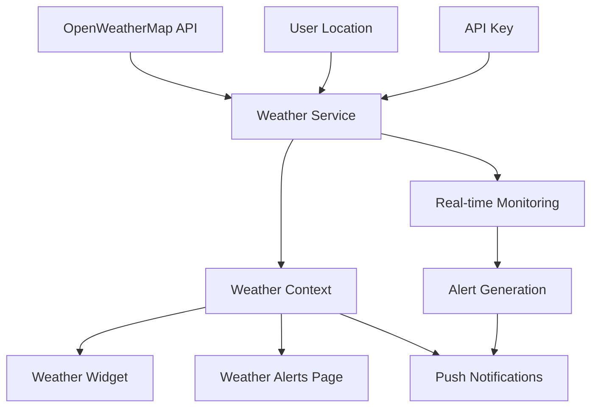

# 🌤️ Weather Alerts Integration Guide

## Overview

Suraksha now includes real-time weather monitoring and emergency alert capabilities powered by **OpenWeatherMap API**. This feature enhances disaster preparedness by providing:

- **Real-time weather alerts** for severe conditions
- **Air quality monitoring** for environmental hazards
- **5-day weather forecasts** for planning ahead
- **Location-based monitoring** for specific campus areas
- **Push notifications** for critical weather events

## 🔧 Setup Instructions

### 1. Get OpenWeatherMap API Key

1. Visit [OpenWeatherMap API](https://openweathermap.org/api)
2. Sign up for a free account
3. Navigate to "API Keys" section
4. Generate a new API key
5. Copy the API key for configuration

### 2. Configure Environment Variables

Create a `.env` file in your project root:

```env
# OpenWeatherMap Configuration
VITE_OPENWEATHER_API_KEY=your_openweather_api_key_here
```

### 3. Set Up Location

1. Navigate to **Weather Alerts** page in the student dashboard
2. Click **Settings** button
3. Enter your OpenWeatherMap API key
4. Set your location (city name and optional country code)
5. Click **Start Monitoring** to begin real-time alerts

## 🌟 Features

### Real-time Weather Alerts

The system monitors for:

- **Severe Thunderstorms** ⛈️
- **High Wind Conditions** 💨 (>15 m/s)
- **Heavy Rain & Flooding** 🌧️
- **Snow & Ice Conditions** ❄️
- **Tornado Warnings** 🌪️
- **Low Visibility** 🌫️ (<1km)

### Air Quality Monitoring

Tracks pollution levels:

- **PM2.5** particulates
- **PM10** particulates  
- **Ozone (O3)** levels
- **Nitrogen Dioxide (NO2)**
- **WHO guidelines** compliance

### Emergency Classifications

Alerts are categorized by severity:

- 🚨 **Critical** - Immediate danger, take shelter
- ⚠️ **High** - Severe conditions, avoid outdoor activities
- ⚡ **Medium** - Caution advised, monitor conditions
- ℹ️ **Low** - Minor impact, stay informed

## 🛠️ Technical Implementation

### Core Components

```typescript
// Weather Service - API integration
src/services/weatherService.ts

// Weather Context - State management
src/contexts/WeatherContext.tsx

// Weather Alerts - Full monitoring interface
src/components/WeatherAlerts.tsx

// Weather Widget - Dashboard summary
src/components/WeatherWidget.tsx

// Student Weather Page
src/pages/student/WeatherAlerts.tsx
```

### API Endpoints Used

```javascript
// Current weather + alerts
https://api.openweathermap.org/data/2.5/onecall

// Air quality data
https://api.openweathermap.org/data/2.5/air_pollution

// Location geocoding
https://api.openweathermap.org/geo/1.0/direct
```

### Data Flow



## 🔔 Notification System

### Browser Notifications

- **Critical alerts** trigger browser push notifications
- **Permission requested** automatically on monitoring start
- **Sound & visual alerts** for severe weather

### In-App Alerts

- **Red alert cards** with severity badges
- **Dismissible notifications** for resolved conditions
- **Recommendation lists** for safety actions
- **Real-time updates** every 15 minutes

## 📊 Integration Points

### Student Dashboard

- **Weather Widget** shows current conditions and active alerts
- **Quick access** to detailed weather monitoring page
- **Critical alert indicators** with visual warnings

### Emergency System

- **Weather alerts** integrate with existing emergency protocols
- **Automated recommendations** based on disaster type
- **Campus map integration** for location-specific guidance

### Admin Features (Future Enhancement)

- **Institution-wide alerts** broadcasting
- **Weather-based drill scheduling**
- **Analytics dashboard** for weather impact on activities

## 🎯 Use Cases

### For Students

- **Daily planning** with weather-aware decisions
- **Emergency preparedness** with advance warnings
- **Safety guidance** during severe weather events
- **Air quality awareness** for health conditions

### For Administrators

- **Campus safety monitoring** 
- **Event planning** with weather considerations
- **Emergency response coordination**
- **Risk assessment** for outdoor activities

## ⚡ Performance Features

### Optimized API Usage

- **Cached responses** to minimize API calls
- **Batched requests** for multiple data types
- **Error handling** with fallback mechanisms
- **Rate limiting** compliance

### Real-time Monitoring

- **Configurable intervals** (default: 15 minutes)
- **Background monitoring** with minimal resource usage
- **Smart alerting** to avoid notification spam
- **Local storage** for user preferences

## 🔒 Privacy & Security

### Data Protection

- **API keys stored locally** in browser storage
- **No server-side storage** of personal location data
- **User-controlled monitoring** with easy disable option
- **HTTPS-only** API communications

### Location Privacy

- **User-specified locations** only
- **No GPS tracking** or automatic location detection
- **City-level precision** for privacy protection
- **Deletable location data**

## 🚀 Future Enhancements

### Planned Features

- **Multi-location monitoring** for campus expansions
- **Historical weather data** analysis
- **Integration with IoT sensors** on campus
- **SMS/Email alerts** for critical conditions
- **Weather-based curriculum** adjustments

### API Extensions

- **Severe weather radar** integration
- **Lightning detection** services  
- **Flood monitoring** systems
- **Earthquake early warning** networks

## 🧪 Testing & Development

### Local Development

```bash
# Set up environment
cp .env.example .env
# Add your OpenWeatherMap API key

# Install dependencies
npm install

# Start development server
npm run dev
```

### Testing Weather Alerts

1. Use test locations with known severe weather
2. Simulate API responses for alert conditions
3. Test notification permissions and delivery
4. Verify alert dismissal and management

## 📚 API Documentation

### OpenWeatherMap Endpoints

- [Current Weather API](https://openweathermap.org/current)
- [One Call API 3.0](https://openweathermap.org/api/one-call-3)
- [Air Pollution API](https://openweathermap.org/api/air-pollution)
- [Geocoding API](https://openweathermap.org/api/geocoding-api)

### Rate Limits

- **Free Plan**: 1,000 calls/day, 60 calls/minute
- **Monitoring Interval**: Configurable (default 15 minutes)
- **Estimated Usage**: ~96 calls/day per location

---

*Weather monitoring enhances Suraksha's disaster preparedness capabilities by providing real-time environmental awareness for educational institutions.*